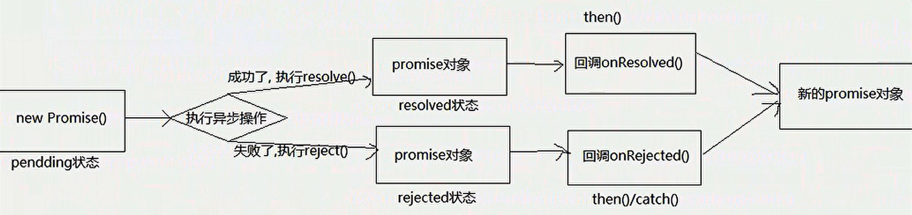

# 第一章：准备

## 1.1 区别实例对象与函数对象

1. 实例对象： new函数产生的对象，称为**实例对象**，简称对象。
2. 函数对象：讲函数作为对象使用时，简称**函数对象**。

```js
function Fn(){ }
const fn = new Fn() // Fn是构造函数，fn是实例对象
console.log(Fn.prototype) // Fn是函数对象
Fn.call({}) // Fn是函数对象
$('#div') // jQuery函数
$.get('./test') // jQuery函数对象
```

## 1.2 两种类型的回调函数

1. 同步回调：立即执行，不会放入回调队列
2. 异步回调：不会立即执行，先放入回调队列，等主线程结束后才执行

## 1.3 常见内置错误

### 1.3.1 错误类型

1. `Error` 所有错误的父类型（对象）

2. `ReferenceError` 引用的变量不存在

   * ```js
     console.log(A)  // ReferenceError: A is not defined 
     ```

3. `TypeError` 数据类型不正确

   - ```js
     let b
     console.log(b.xxx) // TypeError: Cannot read property 'xxx' of undefined
     let a = {}
     a.xxx() // TypeError: a.xxx() is not a function
     ```

4. `RangeError` 数值超出允许范围

   - ```js
     function fn(){ fn() } // 函数递归
     fn() // RangeError: Maximum call stack size exceeded
     ```

5. `SyntaxError` 语法错误

### 1.3.2  错误处理

Error是一个对象，包括`message`属性（记录错误相关信息）和`stack`属性（函数调用栈记录信息）。

1. `try...catch`  捕获错误

   - ```js
     try {
        let d
        console.log(d.xxx);
      } catch(error) {
        console.log(error.message); // 错误内容
        console.log(error.stack); // 完整信息
      }
     ```

2. `throw error` 抛出错误

   - ```js
     function foo(){
       if(Date.now()%2 === 1) console.log('奇数时间，正常执行');
       else throw new Error('抱歉，偶数时间，无法执行！')
     }
     
     try{
       foo()
     } catch(error){
       alert(error.message)
     }
     ```

   

# 第二章：Promise的理解和使用

## 2.1 Promise是什么？

### 2.1.1 理解

1. 抽象表达

   Promise是JS中进行异步编程的新的解决方案。（*旧的？）

2. 具体表达
   - 从语法上来讲：Promise是一个构造函数
   - 从功能上来讲：Promise对象用来封装一个异步操作并可以获取其结果

### 2.1.2  Promise的状态改变

1. pending变成resolved，结果数据称为value
2. pending变成rejected，结果数据称为reason

说明：只有这两种，且一个Promise对象只能改一次状态，且无论什么状态都有一个结果。

### 2.1.3 Promise的基本流程



